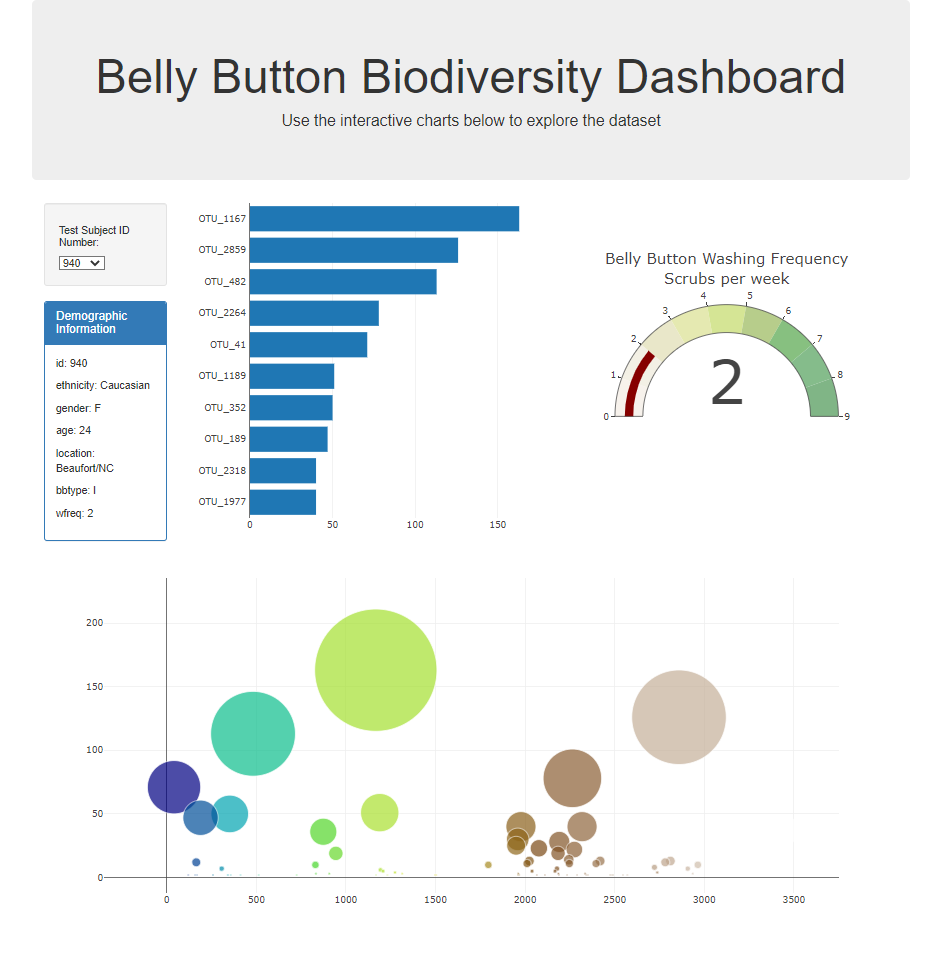

# Belly button database
## Introduction
In this assignment, we built an interactive dashboard to explore the Belly Button Biodiversity datasetLinks to an external site, which catalogs the microbes that colonize human navels.   
The dataset reveals that a small handful of microbial species (also called operational taxonomic units, or OTUs, in the study) were present in more than 70% of people, while the rest were relatively rare.

## Dataset used
[Belly Button Biodiversity](http://robdunnlab.com/projects/belly-button-biodiversity/)

## Tools used
* [D3 library:](https://github.com/d3/d3/wiki)
    * json promises, to request data from an API.
    * selection appends, to populate options to dropdown menu from API response.
* [Plotly:](https://plotly.com/javascript/)
    * Bar charts.
    * Bubble charts.
    * Gauge indicator.
    
## Results

